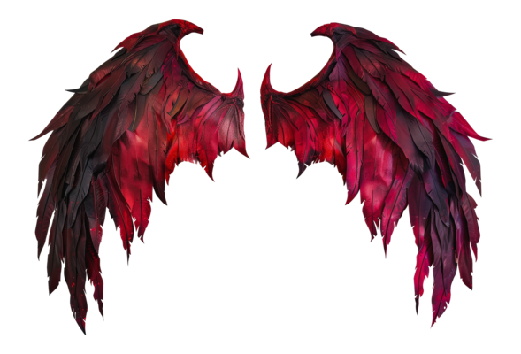

<h1 color="red">𓆩Welcome𓆪</h1>
<h1 color="red">𓆩To𓆪</h1>
<h1 color="red">𓆩Đⱥɍē Đēꝟīł Ⱳēƀ𓆪</h1>
       

<ul>
<li>The devil’s game rises, Dare Devil is now live on the web...🔥🕷️</li> 
<li>Sinfully fun, brutally challenging—just the way the devil likes it...🔥👹</li>
<li>A labyrinth of torment and temptation—every turn a trap...🔥👁️</li>⠀⠀⠀⠀⠀⠀⠀⠀⠀⠀⠀⠀⠀⠀⠀⠀⠀⠀⠀⠀⠀⠀⠀⠀⠀⠀⠀⠀
</ul>

## Ledger of the Damned👹⠀⠀⠀⠀⠀⠀⠀⠀⠀⠀⠀⠀⠀⠀⠀⠀⠀⠀⠀⠀⠀⠀⠀
 * [What dark<-💀->secret lurks within??](#about-the-project)
   * [Cursed Materials](#made-with)
 * [Awakening the Shadows](#getting-started)
 * [Infernal Engineer](#contact)
 * [Do you lack the courage to face the darkness..👺???](#bestwishes)

# What dark<-💀->secret lurks within??
- This game is all about DOM Manipulation,a test of control, risk, and submission. You start with 99 souls but can wager more if you dare.😈
  Built for those who crave challenge, this game uses tarot cards—each one hiding truths you must reveal. Choose your path: Sinister or Inferno. The Devil will draw a card and demand an answer.Obey correctly, and you're spared. Disobey… and souls will be taken. ☣️

## Cursed Materials
This infernal creation wrought from the dark arts of HTML, the mystic styles of CSS, and the arcane spells of JavaScript…
 - 
 - 
 - 

# Awakening the Shadows
- Here lies the portal—dare to enter and play, if you dare… 😈🔥: <a href="https://dare-devil-web-4227e.web.app/">Dare Devil</a>

# Infernal Engineer

 <b color="blue">akashsil420@duck.com</b>

# Do you lack the courage to face the darkness..👺???
  * Unleash your daring spirit and let the infernal challenge consume you...😈
  * Your soul is the ultimate prize in this dark game...👹
  * Victory tastes sweeter when the stakes are your soul...😈
  * Don't be greedy...👿
